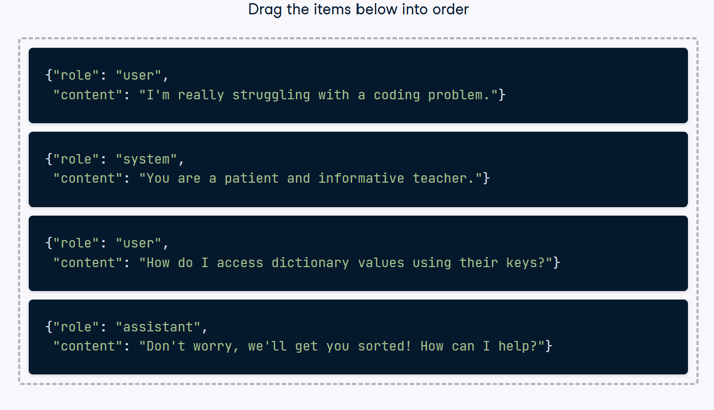

Structuring chat messages
You've seen how chat roles can change the model behavior, provide examples, and bring structure to your messages, but can you structure these messages?

Order the messages to how they would be ordered in a chat message request.

