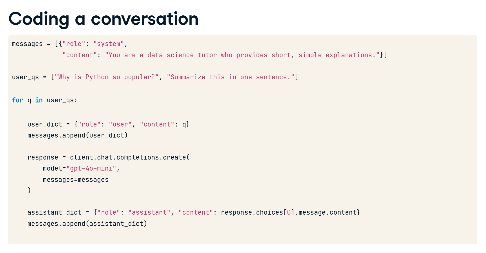

create multi-turn conversations with the OpenAI API. It involves storing previous messages in a list to maintain context, so the model can respond appropriately based on the conversation history. This approach is fundamental for building chatbots that can handle back-and-forth interactions naturally.

