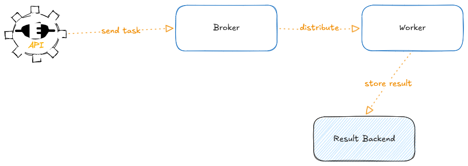

Core Architecture

Celery architecture has 4 main components.

1. Broker (Message Queue)

The broker is the middleman.

It stores tasks temporarily until workers pick them up.

Popular Brokers
Redis
RabbitMQ
Broker Analogy

Think of it like:

Task inbox
Job queue
Delivery center

API places tasks there.

Workers collect tasks from there.

Example

API:

send_email.delay(user.id)

Task goes into Redis queue.

Worker later executes:

send_email(user.id)

2. Worker

Worker is the actual executor.

It continuously listens to broker queues.

When task arrives:

Worker -> picks task -> executes task

__Worker Responsibilities__
Execute tasks
Retry failed jobs
Run tasks concurrently
Process multiple queues
Example Worker Command
celery -A app worker --loglevel=info

This starts a worker process.

3. Result Backend

Stores task results/status.

Without backend:

Task runs
Result disappears

With backend:

You can check:
success
failure
return value
progress
Popular Result Backends
Redis
Database
Memcached
Example
result = add.delay(5, 3)

print(result.status)
print(result.result)

Possible statuses:

PENDING
STARTED
SUCCESS
FAILURE
RETRY

Full Request Flow

Let’s understand complete lifecycle.

Scenario: User Uploads Video
Step 1 — User Hits API
POST /upload-video

API receives video.

Step 2 — API Creates Celery Task
process_video.delay(video_path)
Step 3 — Broker Stores Task

Redis queue now contains:

Task: process_video(video_path)
Step 4 — Worker Picks Task

Worker continuously checks queue:

Found new task!

Starts processing video.

Step 5 — Result Backend Stores Status
SUCCESS

or

FAILURE
Step 6 — User Checks Status

Frontend polls:

GET /task-status/123

API checks backend.

Practical FastAPI + Celery Architecture

Since you're learning backend/system design, this is the most common production setup.

                +-------------+
                |   Client    |
                +-------------+
                       |
                       v
                +-------------+
                |   FastAPI   |
                +-------------+
                       |
               enqueue task
                       |
                       v
                +-------------+
                |    Redis    |
                |  (Broker)   |
                +-------------+
                       |
                       v
                +-------------+
                |   Worker    |
                |   Celery    |
                +-------------+
                       |
                store results
                       |
                       v
                +-------------+
                |   Redis DB  |
                +-------------+