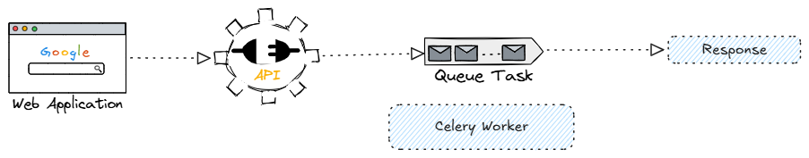

What is Celery?

Celery is a distributed task queue system used mainly in Python applications to run tasks asynchronously and in the background.

Instead of making your API wait for a heavy job to finish, Celery sends the task to a queue and lets another process handle it later.

Real-Life Analogy

Imagine a restaurant.

Customer places an order → API request
Waiter takes order → API server
Kitchen staff cooks food → Celery worker
Order slip board → Message broker

If the waiter cooks food himself, customers wait a long time.

Instead:

Waiter writes order
Places it on kitchen board
Kitchen prepares food
Waiter continues serving other customers

That kitchen board is the broker.

Why Celery Exists

Without Celery:

User Request -> API -> Heavy Task -> Response

If task takes 2 minutes:

API blocks
User waits
Server becomes slow

With Celery:

User Request -> API -> Queue Task -> Immediate Response
                                 ↓
                            Celery Worker

Now API responds instantly.

When to Use Celery

Use Celery when tasks are:

Slow
CPU-heavy
I/O-heavy
Scheduled
Retryable
Independent from immediate API response
Common Use Cases
1. Sending Emails

User registers:

POST /signup

Instead of:

send_email()

inside API request,

you do:

send_email.delay()

API responds instantly while worker sends email.

2. Image/Video Processing

Example:

Resize uploaded image
Convert video formats
Generate thumbnails

These may take several seconds/minutes.

Perfect for Celery.

3. PDF/Report Generation

Example:

Generate invoice PDF
Export Excel reports
Build analytics dashboard

Heavy computation should run in background.

4. Machine Learning Jobs

Example:

Run prediction
Train model
Process embeddings

These are long-running tasks.

5. Scheduled Jobs

Example:

Daily backups
Cleanup temp files
Send weekly reports

Celery supports periodic tasks using Celery Beat.

